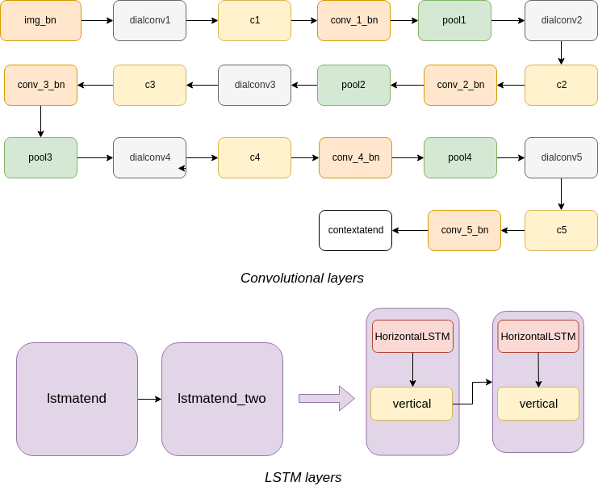
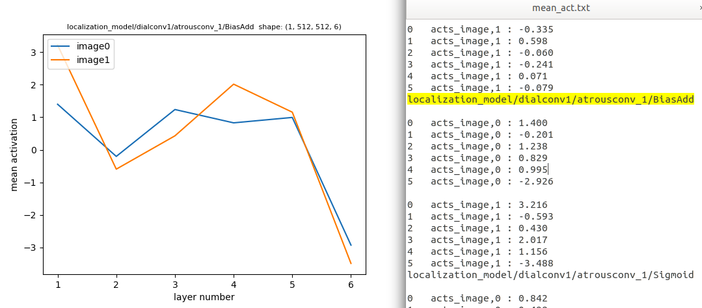
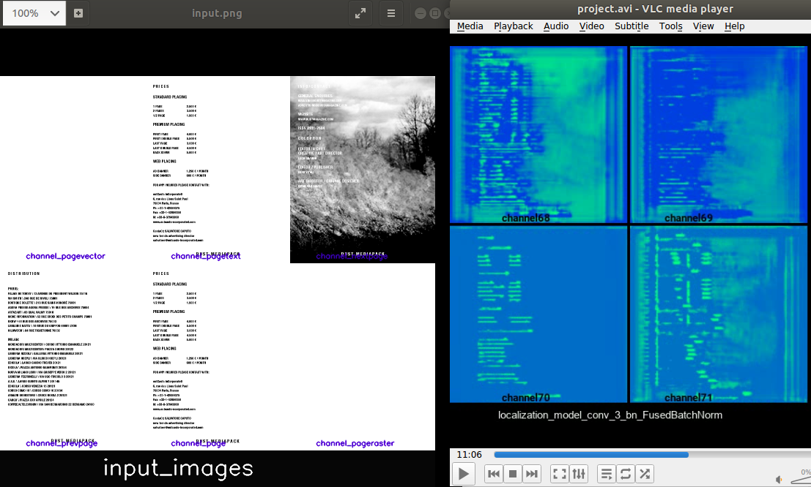

# Making Yoda interpretable

Despite all the exciting news about Deep Learning, the exact way neural networks see and interpret the world remains a black box. With the growing success of neural networks, there is a corresponding need to be able to explain their decisions. 

Yoda is a deep neural network (based on YOLO/SSD) comprising of different convolutional and LSTM layers, capable of detecting various document classes (text, list, table, figure, footnote, headings) and predicting their artifact probabilities. 
We aim to visualize this custom object detection model and better understand how exactly it recognizes specific patterns or objects.


## Table of Contents

- [ More About Yoda ](#yoda)
- [ Aim ](#aim)
- [ Installation ](#install)
- [ Usage ](#use)
  - [ Directory structure ](#dir)
  - [ Visualizing the Yoda layers ](#vis)
    - [ Activation Plots ](#act)
    - [ Feature Visualization ](#feat)
  - [ Perturbing the input ](#per)
- [ References ](#ref)

<a name="yoda"></a>
## More About Yoda

- Yoda takes 6 images of PDF as input : channel_page, channel_pagetext, channel_pagevector, channel_pageraster, channel_prevpage, channel_nextpage.
- The padded inputs are fed into the 'localization_model' which contains the convolutional and LSTM layers.

 <p align="center">
  
</p>
 <p align="center"><b><i>localization_model</i></b></p>
 
- The output consists of predicted_bboxes, predicted_artifacts, predicted_classes, predicted_acp and predicted_confidence.

<a name="aim"></a>
## Aim

- remove the non-useful filters/weights 
- learn about the visualizations at different layers. 
- identify the sections of input image causing specific mispredictions. 

<a name="install"></a>
## Installation

1. We need python-3.6 virtualenv.
2. Create a virtual env and install all the necessary modules: 
```
pip install -r requirements.txt 
```
<a name="use"></a>
## Usage
<a name="dir"></a>
### Directory structure
 - The repository, **yoda_experiment/** is divided into two subsequent parts: **viz_layers/** containing all the necessary files for vizualization of Yoda, and **perturb_input/** has the files for how to perturb the input image somehow, to affect the predictions in desired way. 
 - The files not in either of the above are common to the whole repository.
 - Each of the above directory contains a directory named **data/** dealing with all the necessary input and output files.
 
<a name="vis"></a>
### Visualizing the Yoda layers

- Switch to the directory, **viz_layers**.
```
cd viz_layers
```
- Upload the input files i.e. 6 input pages in **data/** with a different serial number:
```
input1
input2
input3
```
- Each input folder contains 6 images named:
```
channel_page.png
channel_pagetext.png
channel_pagevector.png
channel_pageraster.png
channel_prevpage.png
channel_nextpage.png
```
- The outputs for the corresponding input files will be stored inside the **data/** as:
```
output1
output2
output3
```
<a name = "act"> </a>
#### 1. Activation Plots

1. Use **'cmp_images.py'**  to compare more than one image for their activations at different layers. This script plots the graphs for mean or max activations at each layer for different channels.
```
python cmp_images.py 2 mean
```

- The first argument i.e. 2 signifies the number of images to be compared and the second whether to plot mean activations or max activation at various channels.
- The user will be prompted to enter path of different image folders:
  ```
  Enter path to input folder0 viz_layers/data/input1
  Enter path to input folder1 viz_layers/data/input2
  ```
- The graph plots will be stored in a directory inside **data/**, named **cmp_plots/output_1-2**, if input1 and input2 are compared.
- The name of "output_1-2" will change according to the inputs used eg. output_2-3 if input2 and input3 are to be compared.
- The file named **mean_act.txt** will be saved inside **cmp_plots/output_1-2** storing all the mean/max activations of the two inputs.
 
 <p align = center>
 
 </p>
 
 2. Use **cmp_mean-max.py** to compare mean and max activations of an image at different channels of corresponding layers.
 ```
python cmp_mean-max.py viz_layers/data/input1
```
- 'input1' specifies the directory containing the 6 input images named 'channel_page.png', .... 'channel_nextpage.png'.
- The resulting plots will be saved to **data/output1/mean-max_plots/**.
- The name of "output1" will change according to the inputs eg. output2 for input2.
- The file named **mean-max_act.txt** will be saved inside **data/output1/mean-max_plots/** storing all the mean,max activations of the input.

<a name = "feat"> </a>
#### 2. Feature Visualization

With the help of activation plots, we know how the activations are changing mathematically, but what if we can do this in a much better way i.e. **VISUALLY!** 

- To see how Yoda progreeses for a given input image, what is learned at every layer of Yoda can be analysed by **make_video.py**. 
 ```
  python make_video.py viz_layers/data/input3
 ```
- The output files are stored in **data/output3/video_res**:
 ```
 input.png
 input_imgs/
 project.avi
 vis_imgs_norm/
 vis_imgs_color/
 vis_imgs_padded/
 ```
- The video named **project.avi** shows the visualizations of our input. 
- Along with the video, we can analyse the images individually by referring to the directories, **vis_imgs_norm/** or **vis_imgs_color/**.
- Below is how project.avi for the input3 would look like.

<p align = center>
 
</p>

<a name="per"></a>
### Perturbing the input

- Switch to the directory, **perturb_input**.
```
cd perturb_input
```
- Upload the input files i.e. 6 input pages in **data/input** with a different serial number as we did for viz_layers/.

- The outputs for the corresponding input files will be stored inside the **data/output**.

-  We need to modify some 'lucid' files to use it for Yoda. The overwritten lucid files can be found in the directory **lucid_changes/**. Make sure the correct lucid files are accessed while perturbing the image. Overwrite the following files:
   ```
   lucid/modelzoo/vision_base.py
   lucid/optvis/objectives.py
   lucid/optvis/render.py
   lucid misc/io/serialize_array.py
   ```
- To perturb an input image in order to correct predictions, run **perturb_input.py**.
  ```
  python perturb_input.py perturb_input/data/input1
  ```
  The first arguement contains the path to input folder.
 
- The output files are stored in **data/output1/**:
  ```
  original_preds/
  changed_images/
  changed_predictions/
  diffs/
  viz.npy
  ```
- **original_preds/** contains the bounding box visualizations of predictions for the input image. The anchor boxes with confidence > 0.4 will be saved.

- Enter the bounding box number whose probability needs to be changed. Observe from the images stored in "original_preds/". The corresponding softmax cell number will be displayed on the terminal.
  ```
  observe the predictions and enter the bbox number we need to target: 5
  592
  ```
- Enter the channel number according to the item name we want our model to detect.
  ```
  0 --> background, 1 --> text, 2 --> list, 3 --> footnote, 4 --> heading, 5 --> table, 6 --> figure
  Input the channel number for which we need the maximum activation: 2
  ```
- Enter the learning rate. The loss function or number of iterations can be modified in **perturb_input.py**.
  ```
  Optimizing the input image:
  Enter learning rate: 0.0005
  ```
- Now the input image starts getting optimized. Loss will be dispayed for each iteration. If the process is stopped before completion of all iterations, the perturbed image upto the running point will be stored in **data/ouput1/viz.npy** as numpy array or **data/output1/changed_images/new_img.png** as an image file.

- **data/output1/changed_predictions** will be showing all the bounding box visualizations for our changed image, stored in viz.npy. Verify the results by comparing the 'original_preds/' and 'changed_predictions/'.

- We can compare the new image and original one using **imagemagick**.
  ```
  compare data/input1/channel_page.png data/output1/changed_images/channel_page.png data/output1/diffs/diff.png
  ```
  **diff.png** will show the visual difference between the two images.
- Refer to [perturb_readme.md](images/readme2.md)

<a name="ref"></a>
### References

Please refer to the word documennt for observations and results in detail. 


