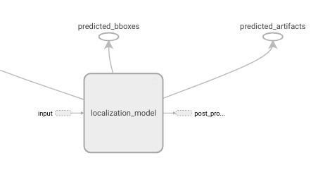

## Making Yoda interpretable

Despite all the exciting news about Deep Learning, the exact way neural networks see and interpret the world remains a black box. With the growing success of neural networks, there is a corresponding need to be able to explain their decisions. 

Yoda is a deep neural network (based on YOLO/SSD) comprising of different convolutional and LSTM layers, capable of detecting various document classes (text, list, table, figure, footnote, headings) and predicting their artifact probabilities. 
We aim to visualize this custom object detection model and better understand how exactly it recognizes specific patterns or objects.


### Table of Contents

- [ More About Yoda ](#yoda)
- [ Installation ](#install)

<a name="yoda"></a>
### More About Yoda

- Yoda takes 6 images of PDF as input : channel_page, channel_pagetext, channel_pagevector, channel_pageraster, channel_prevpage, channel_nextpage.
- The padded inputs are fed into the 'localization_model' which contains the convolutional and LSTM layers. 
 <p align="center">
  
</p>                

<a name="install"></a>
### Installation

1. We need python-3.6 virtualenv.
2. Create a virtual env and install all the necessary modules: 
```
pip install -r requirements.txt 
```
 
### Getting Started

#### _Activation Plots_

1. Use **'cmp_images.py'**  to compare more than one image for their activations at different layers. This script plots the graphs for mean or max activations at each layer for different channels.
```
python cmp_images.py 2 mean
```

The first argument i.e. 2 signifies the number of images to be compared and the second whether to plot mean activations or max activation at various channels.
The user will be prompted to enter path of different image folders:
```
Enter path to input folder0 input1
Enter path to input folder1 input2
```
Each input folder contains 6 images named:
```
channel_page.png
channel_pagetext.png
channel_pagevector.png
channel_pageraster.png
channel_prevpage.png
channel_nextpage.png
```
The output will be stored in a directory named **test_plots/**
 
2. Use **cmp_mean-max.py** to compare mean and max activations of an image of different channels at corresponding layers.
The resulting plots will be saved to a directory named **mean-max_plots/** . 
```
python cmp_mean-max.py 'input1'
```
The first argument 'input1' specifies the directory containing the 6 input images named 'channel_page.png', .... 'channel_nextpage.png'.

#### _Feature visualization_

To see how Yoda progreeses for a given input image, what is learned at every layer of Yoda can be analysed by **make_video.py**. This script outputs a video named **project.avi** which shows the visualizations of our image. Along with the video, we can analyse the images individually by referring to the directories named **vis_imgs_norm/** or **vis_imgs_color/** formed after running the script.
```
python make_video.py 'input1'
```

####  _Perturbing input_ 

To perturb an input image in order to correct predictions, take a look at **perturb_input.py**. We need to modify some 'lucid' files to use it for Yoda. The overwritten lucid files can be found in the directory **lucid/**. 
```
python perturb_input.py 'input1'
```
This script will make a directory named **output/** which in turn would furthur constitute:
```
preds/
perturbed/
preds_new_img/
new_img.png
new_page.png
new_pagetext.png
new_pagevec.png
viz.npy
diff.png
```
**preds/** contains the bounding box visualizations of predictions for the input image. After that user will be prompted for the cell and channel number of softmax layer, to define the loss function. The respective cell of softmax will be displayed.
```
observe the predictions and enter the bbox number we need to target: 5
592
```
Enter the channel number according to the item name we want our model to detect.
```
0 --> background, 1 --> text, 2 --> list, 3 --> footnote, 4 --> heading, 5 --> table, 6 --> figure
Input the channel number for which we need the maximum activation: 2
```
User will be asked to enter the learning rate. The loss function or number of iterations can be modified in **perturb_input.py**.
```
Optimizing the input image:
Enter learning rate: 0.0005
```
**perturbed/** will be containing all the perturbed images at different thresholds. If the process is stopped before completion of all iterations, the perturbed image upto the running point will be stored in **viz.npy** as numpy array or **new_img.png** as an image file.

**preds_new_img/** will be showing all the bounding box visualizations for our new image, stored in viz.npy. Verify the results by comparing the 'preds/' and 'preds_new_img/'.

We can compare the new image and original one using **imagemagick**.
```
compare input1/channel_page.png output/new_img.png diff.png
```

**diff.png** will show the visual difference between the two images.


### References


